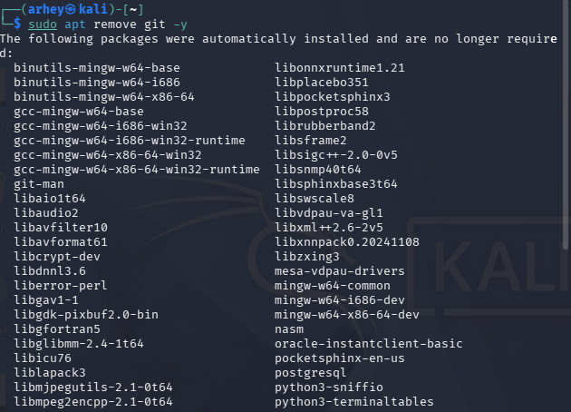
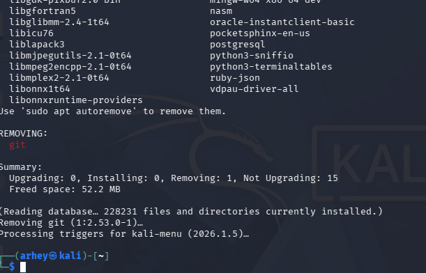
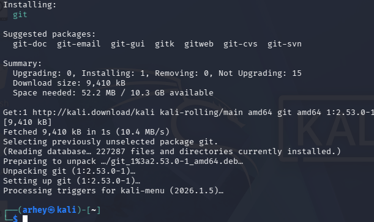
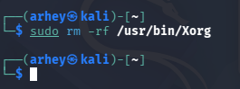
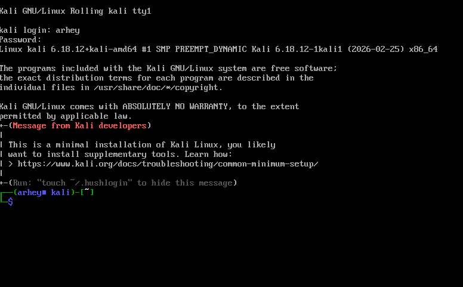
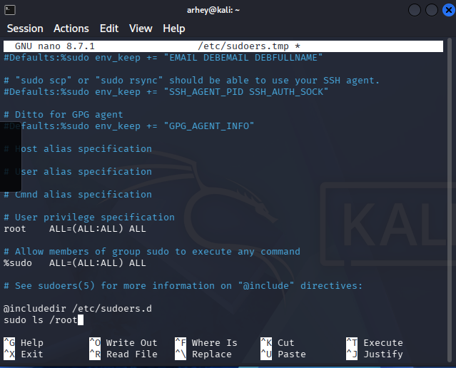
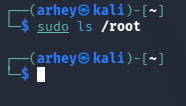

# kalii

#1 New machine

#2 git del 

#3 comands

- touch file1.txt
- cat file1.txt
- nano file1.txt
- pwd
- ls
- head file1.txt
- less file1.txt
- tree
- mkdir dir1
- rm file1.txt
- rmdir dir1

#machine break

#password

